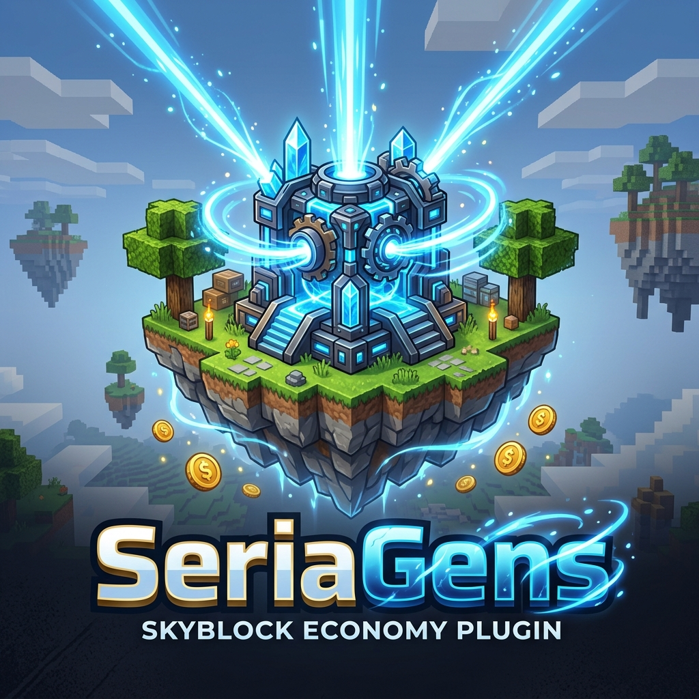

# SeriaGens

## Overview
**SeriaGens** is a high-performance generator system specifically designed for Skyblock and Island-based game modes. It features a sophisticated economy, generator corruption mechanics, and a unique "Joules" energy system.

## Features
- **Dynamic Generators**: Customizable generators that produce items over time.
- **Energy System (Joules)**: Generators require or produce Joules to function, adding a layer of management.
- **Corruption Mechanics**: Generators can become corrupted, requiring player interaction to restore efficiency.
- **Global Events**: Server-wide events that boost generator production or fuel efficiency.
- **Integrated Shop**: Built-in GUI shop for purchasing and upgrading generators.
- **BentoBox Integration**: Deeply integrated with BentoBox for island-specific generator limits and permissions.

## Commands
- `/seriagens`: Main admin command.
- `/genshop`: Open the generator store.
- `/genset`: Manage your placed generators.
- `/gensell`: Quickly sell items produced by generators.
- `/genevent`: Manage generator-related server events.

## Developer Wiki
For detailed placeholder lists, fuel configuration, and event setup, visit the [Wiki](docs/WIKI.md).
